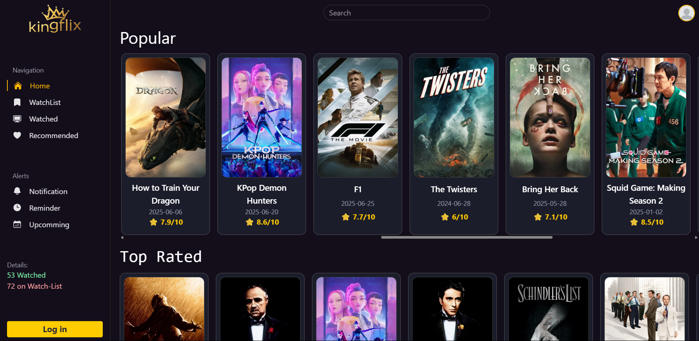
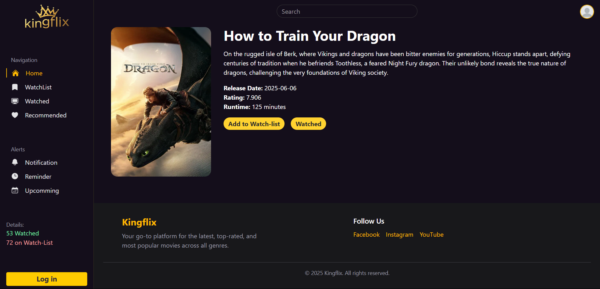

# KingFlix – React Movie Explorer

A sleek and modern movie browsing application built with **React.js**, **Vite**, and **TMDB API**, featuring:

* Trending & top-rated movies
* Infinite scroll for "All Movies"
* Movie search functionality
* Detailed view for each movie
* Fully responsive layout with sidebar & navbar
* Custom styling using Tailwind CSS

---

## 🚀 Features

-  **Search movies** by title
-  **Browse categories**: Popular, Top Rated, All
-  **View detailed info**: Runtime, rating, release date, etc.
-  **Infinite scroll** for exploring all movies
-  **Clean UI** with dark mode and responsive design
-  **Component-based structure** for easy scalability

---

## 📦 Tech Stack

* **React.js (with Vite)**
* **Tailwind CSS**
* **React Router DOM**
* **TMDB (The Movie Database) API**
* **Heroicons**
* **React Infinite Scroll Component** (optional)
* Custom reusable components (`<MovieCard />`, `<MainLayout />`, `<Button />`, etc.)

---

## 📁 Project Structure

```
    src/
    │
    ├── components/
    │   ├── movieCard.jsx
    │   ├── Navbar.jsx
    │   ├── Sidebar.jsx
    │   ├── Footer.jsx
    │   ├── Button.jsx
    │
    ├── layout/
    │   └── MainLayout.jsx
    │
    ├── pages/
    │   ├── Home.jsx
    │   ├── MovieDetails.jsx
    │   └── Search.jsx
    │
    ├── App.jsx
    ├── main.jsx
    ├── index,css
    └── App.css

    index.html
```

---

## 🔑 Setup Instructions

### 1. Clone the Repository

```bash
git clone https://github.com/your-username/kingflix.git
cd kingflix
```

### 2. Install Dependencies

```bash
npm install
```

### 3. Setup Environment Variables

Create a `.env` file in the root and add your TMDB API bearer token:

```env
VITE_TMDB_API=your_tmdb_bearer_token_here
```

> ⚠️ **Important**: Use a **Bearer Token** (not just the API key). You can generate one from [TMDB account > settings > API](https://www.themoviedb.org/settings/api).

### 4. Run the Development Server

```bash
npm run dev
```

---

## 🌐 Routes

| Route               | Description                  |
| ------------------- | ---------------------------- |
| `/`                 | Homepage with movie sections |
| `/movie/:id`        | Movie detail page            |
| `/search?query=xyz` | Search results for a keyword |

---

## 💡 Customization Ideas

* Add **watchlist** and **favorites** using `localStorage`
* Support for **TV shows** or **genres**
* User authentication with Firebase or Supabase
* Theme toggler (light/dark mode)

---

## 📸 Screenshots

### 🏠 Home Page


### 🎥 Movie Details



---

## 🧑‍💻 Author

* **Riman Maharjan**
* React, Web & API Developer
* GitHub: [@riman7](https://github.com/riman7)

---

## 📜 License

This project is licensed under the [MIT License](LICENSE).

---

## 🌟 Show Your Support

If you like this project, please ⭐ the repo or share it with friends! and feel free to contribute.
